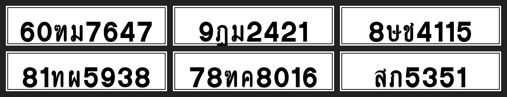

# Thai Plate Synth — Synthetic Data for Thai License-Plate OCR

End-to-end Thai license-plate OCR with a **synthetic-data-first** pipeline.
The research asset is an open plate renderer that covers the full Thai alphabet;
the product asset is a YOLOv8 recognizer and FastAPI/Streamlit demo trained on it.

## Why

Public Thai-plate datasets are small, partially anonymised (opaque `A##` class
labels), and don't cover all 44 Thai consonants or province text. Our prior
project [`thai-plate-ocr`](https://github.com/simonyos/thai-plate-ocr) ran into
exactly this ceiling: only 8 of 44 consonants could be mapped from the public
labels. Hand-labeling at scale is expensive.

This project tests whether a parametric plate renderer — using the canonical
Thai highway-signage font and domain-randomised augmentation — can replace
most of that human labeling effort.

## Thesis

> Synthetic plates rendered with the canonical font plus realistic augmentation
> can train a stage-2 character recognizer that matches or exceeds the
> real-data baseline, with **<2 hours** of human labeling needed only for a
> held-out real-world test set.

## Plan

| Weekend | Deliverable |
|---|---|
| 1 | Renderer MVP — white/private plates, all 44 consonants + 10 digits, YOLO char bboxes |
| 2 | Train stage-2 on synth-only; evaluate on the `thai-plate-ocr` validation gallery |
| 3 | Realism pass — perspective, motion blur, lighting, background compositing |
| 4 | Hand-label ~50 real plates as held-out benchmark; run all training regimes |
| 5 | Streamlit demo + Hugging Face Space + writeup |
| 6 | Polish, province rendering, demo GIF |

## Setup

```bash
# 1. Download the font (not redistributable — see assets/fonts/README.md)
#    https://www.f0nt.com/release/saruns-thangluang/  →  assets/fonts/SarunsThangLuang.ttf

# 2. Install
make setup

# 3. Generate a sample
make sample       # 10 plates → experiments/figures/samples/
make synth        # 1000 plates → data/synth_v1/
```

## Sample renders

Six plates from the weekend-1 renderer (seed=0, no augmentation yet):



All 44 Thai consonants and 10 digits are in the class space; per-character
YOLO bboxes ship alongside every image.

## Status

🚧 Weekend 1 in progress — renderer MVP landed; augmentation and training next.

## License

- Code: MIT — see [LICENSE](LICENSE).
- Font: Sarun's ThangLuang, free for commercial use, **not redistributed**
  ([terms](https://www.f0nt.com/about/license/)). Download separately.
