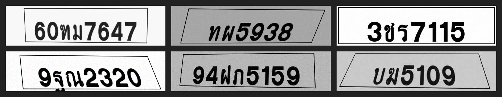
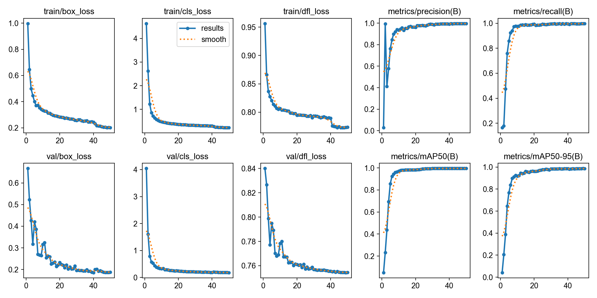
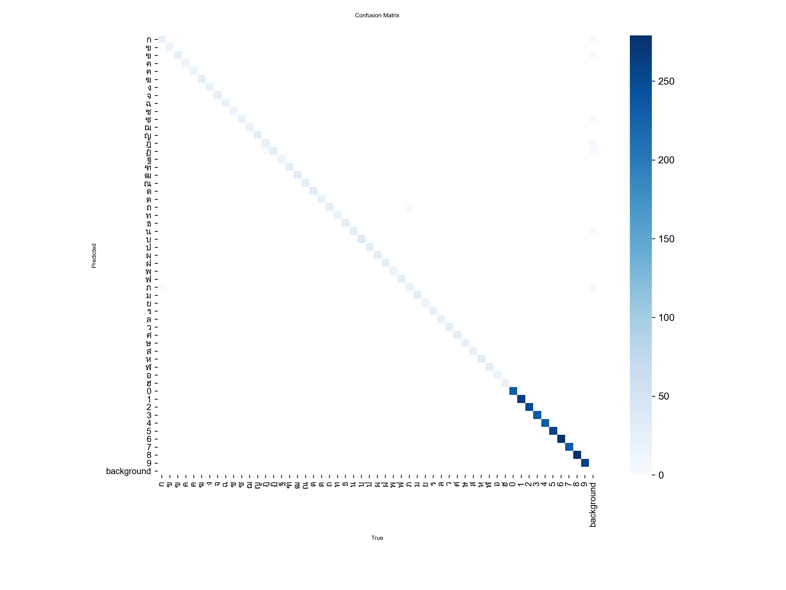

# Thai Plate Synth — Synthetic Data for Thai License-Plate OCR

[](https://colab.research.google.com/github/simonyos/thai-plate-synth/blob/main/notebooks/thai_plate_synth_colab.ipynb)
[](https://www.python.org/downloads/release/python-3110/)
[](LICENSE)

End-to-end Thai license-plate OCR with a **synthetic-data-first** pipeline.
The research asset is an open plate renderer that covers the full Thai alphabet;
the product asset is a YOLOv8 recognizer and FastAPI/Streamlit demo trained on it.

## Why

Public Thai-plate datasets are small, partially anonymised (opaque `A##` class
labels), and don't cover all 44 Thai consonants or province text. Our prior
project [`thai-plate-ocr`](https://github.com/simonyos/thai-plate-ocr) ran into
exactly this ceiling: only 8 of 44 consonants could be mapped from the public
labels. Hand-labeling at scale is expensive.

This project tests whether a parametric plate renderer — using the canonical
Thai highway-signage font and domain-randomised augmentation — can replace
most of that human labeling effort.

## Thesis

> Synthetic plates rendered with the canonical font plus realistic augmentation
> can train a stage-2 character recognizer that matches or exceeds the
> real-data baseline, with **<2 hours** of human labeling needed only for a
> held-out real-world test set.

## Plan

| Weekend | Deliverable |
|---|---|
| 1 | Renderer MVP — white/private plates, all 44 consonants + 10 digits, YOLO char bboxes |
| 2 | Train stage-2 on synth-only; evaluate on the `thai-plate-ocr` validation gallery |
| 3 | Realism pass — perspective, motion blur, lighting, background compositing |
| 4 | Hand-label ~50 real plates as held-out benchmark; run all training regimes |
| 5 | Streamlit demo + Hugging Face Space + writeup |
| 6 | Polish, province rendering, demo GIF |

## Setup

```bash
# 1. Download the font (not redistributable — see assets/fonts/README.md)
#    https://www.f0nt.com/release/saruns-thangluang/  →  assets/fonts/SarunsThangLuang.ttf

# 2. Install
make setup

# 3. Generate a sample
make sample       # 10 plates → experiments/figures/samples/
make synth        # 1000 plates → data/synth_v1/
```

## Sample renders

**Clean (weekend-1):**


**Augmented (weekend-3 — perspective, photometric, blur, noise, JPEG):**



All 44 Thai consonants and 10 digits are in the class space; per-character
YOLO bboxes ship alongside every image and are re-projected through each
geometric augmentation.

## Training runs

YOLOv8n, 50 epochs, imgsz 480, batch 64, seed 42, 5,000 plates each
(4,500 train / 500 val), RTX 3060 Ti 8 GB.

| Run | Augmentation | mAP@0.5 | mAP@0.5:0.95 | Precision | Recall | Train time |
|---|---|---:|---:|---:|---:|---:|
| `synth_v1` | none | 0.995 | **0.995** | 0.997 | 1.000 | 13 min |
| `synth_v2` | perspective + photometric + blur + noise + JPEG | 0.995 | **0.987** | 0.996 | 0.998 | 12.5 min |

The augmented run drops mAP@0.5:0.95 by 0.8 points — exactly the price we
pay for training on perspective-warped boxes whose edges are inherently
less tight. mAP@0.5 and per-class accuracy are unchanged. That's the shape
we want: the model generalises over viewing angles and sensor noise
without losing the clean-case performance.

**Training curves, synth_v2:**



**Confusion matrix, synth_v2** — still clean-diagonal across all 54 classes:



The real test is weekend 4 — running these weights on hand-labeled real
plates from the `thai-plate-ocr` validation gallery. That is where the
synth→real gap actually gets measured.

## Status

✅ Weekend 1 — renderer MVP
✅ Weekend 2 — synth-only training (ceiling: mAP@0.5:0.95 = 0.995)
✅ Weekend 3 — augmentation pipeline + augmented training (mAP@0.5:0.95 = 0.987)
🚧 Weekend 4 — hand-label ~50 real plates; run v1 vs v2 head-to-head

## License

- Code: MIT — see [LICENSE](LICENSE).
- Font: Sarun's ThangLuang, free for commercial use, **not redistributed**
  ([terms](https://www.f0nt.com/about/license/)). Download separately.
